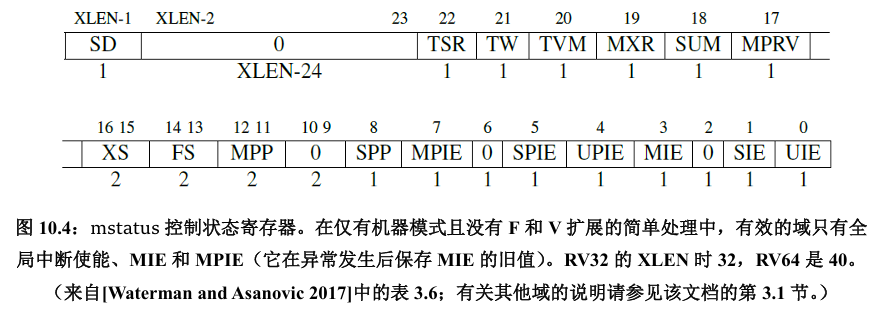

# RISC-V

## 一、为什么要有RISC-V?


### 导言
RISC-V（“ RISC five”）的目标是成为一个通用的指令集架构（ISA）： 
- 它要能适应包括从最袖珍的嵌入式控制器，到最快的高性能计算机等各种规模的处理器。 
- 它应该能兼容各种流行的软件栈和编程语言。 
- 它应该适应所有实现技术，包括现场可编程门阵列（FPGA）、专用集成电路（ASIC）、全定制芯片，甚至未来的设备技术。 
- 它应该对所有微体系结构样式都有效：例如微编码或硬连线控制;顺序或乱序执行流水线; 单发射或超标量等等。 
- 它应该支持广泛的专业化，成为定制加速器的基础，因为随着摩尔定律的消退，加速器的重要性日益提高。 
- 它应该是稳定的，基础的指令集架构不应该改变。更重要的是，它不能像以前的专有指令集架构一样被弃用.

### 模块化与增量型ISA

RICRISC-V的不同寻常之处，除了在于它是最近诞生的和开源的以外，还在于：和几乎所有以往的ISA不同，它是模块化的。它的核心是一个名为RV32I的基础ISA，运行一个完整的软件栈。RV32I是固定的，永远不会改变。这为编译器编写者，操作系统开发人员和汇编语言程序员提供了稳定的目标。模块化来源于可选的标准扩展，根据应用程序的需要，硬件可以包含或不包含这些扩展。这种模块化特性使得RISC-V具有了袖珍化、低能耗的特点，而这对于嵌入式应用可能至关重要。RISC-V编译器得知当前硬件包含哪些扩展后，便可以生成当前硬件条件下的最佳代码。惯例是把代表扩展的字母附加到指令集名称之后作为指示。例如，RV32IMFD将乘法（RV32M），单精度浮点（RV32F）和双精度浮点（RV32D）的扩展添加到了基础指令集（RV32I）中。

### ISA 设计101

衡量标准:
- 成本 晶圆尺寸越小
- 简洁性 
- 性能 time/program
- 架构和具体实现的分离
- 提升空间 预留操作码
- 程序大小 
- 易于编程/编译/链接

## 二、RV32I: RISC-V基础整数指令集


### RV321 指令格式

六种基本指令格式，分别是：
- 用于寄存器-寄存器操作的R类型指令，
- 用于短立即数和访存load操作的I型指令，
- 用于访存store操作的S型指令，
- 用于条件跳转操作的B类型指令，
- 用于长立即数的U型指令
- 用于无条件跳转的J型指令。


### RV32I 寄存器


## 十、RV32/64 特权架构


八个控制状态寄存器（CSR）是机器模式下异常处理的必要部分： 
- mtvec（Machine Trap Vector）它保存发生异常时处理器需要跳转到的地址。 
- mepc（Machine Exception PC）它指向发生异常的指令。 
- mcause（Machine Exception Cause）它指示发生异常的种类。 
- mie（Machine Interrupt Enable）它指出处理器目前能处理和必须忽略的中断。 
- mip（Machine Interrupt Pending）它列出目前正准备处理的中断。 
- mtval（Machine Trap Value）它保存了陷入（trap）的附加信息：地址例外中出错
的地址、发生非法指令例外的指令本身，对于其他异常，它的值为0。 
- mscratch（Machine Scratch）它暂时存放一个字大小的数据。 
- mstatus（Machine Status）它保存全局中断使能，以及许多其他的状态，如图
10.4 所示。 




当一个hart发生异常时，硬件自动经历如下状态转换：

1. 异常指令的PC被保存在mepc中，PC被设置为mtvec。（对于同步异常，mepc
指向导致异常的指令；对于中断，它指向中断处理后应该恢复执行的位置。） 
2. 根据异常来源设置mcause（如图10.3所示），并将mtval设置为出错的地址或
者其它适用于特定异常的信息字。 
3. 把控制状态寄存器mstatus中的MIE位置零以禁用中断，并把先前的MIE值保
留到MPIE中。 
4. 发生异常之前的权限模式保留在mstatus的MPP域中，再把权限模式更改为
M。图10.5显示了MPP域的编码（如果处理器仅实现M模式，则有效地跳过这
个步骤）。

伪码表示：

```
mepc = pc
pc = mtev

mcause = exception or interrupt
mtval = mepc or other

mstatus.mpie = mstatus.mie
mstatus.mie = 0

mstatus.mpp = 0x3 // machine mode
```


## 特权等级

特权等级

目前，RISC-V手册中共定义了3个特权等级：U(00)、S(01)和M(11)。

## 处理器标识寄存器

处理器标识寄存器

点击展开

### misa

misa

| MXL | 0 | Extensions |
| --- | --- | --- |
| 31:30(63:62) | 29:26(61:26) | 25:0 |

**功能**：说明当前硬件线程支持的ISA扩展。`MXL`(Machine XLEN)说明基础整数指令集的位宽，编码如下：`01`\-32 bits，`10`\-64 bits，`11`\-128 bits。当通过写`MXL`字段导致MXLEN改变时，`MXL`会移动到新宽度下该寄存器的最高两位。`Extensions`字段分别表示处理器是否支持A-Z共26个ISA特性。

### mvendorid

mvendorid

**功能**：用于标识处理器供应商的JEDEC ID。可以使用全0表示非商用实现。

### marchid

marchid

**功能**：和`mvendorid`一起，唯一的确定硬件线程的微架构。开源项目的`marchid`由RISC-V International分配，其最高位为0；商用项目由供应商分配，其最高位不为0。

### mimpid

mimpid

**功能**：处理器实现版本的编码。

### mhartid

mhartid

**功能**：标识正在运行代码的硬件线程的ID，必须存在一个ID为0的hart。

## xstatus寄存器

_x_status寄存器

_x_status寄存器是RISC-V处理器中跟踪和控制一个硬件线程执行状态的寄存器。我认为是RISC-V特权架构中最关键的一个寄存器，理解_x_status寄存器中各个字段的意义，有助于理解RISC-V特权架构。sstatus和mstatus寄存器是同一个寄存器在不同特权等级下的不同视图，其中，sstatus寄存器的视图是mstatus寄存器的子集，这里将两个寄存器放在一起有助于对比，RV32中_x_status寄存器字段格式(上为mstatus,下为sstatus)：

| SD | _WPRI_ | TSR | TW | TVM | MXR | SUM | MPRV | XS | FS | MPP | VS | SPP | MPIE | UBE | SPIE | _WPRI_ | MIE | _WPRI_ | SIE | _WPRI_ |
| --- | --- | --- | --- | --- | --- | --- | --- | --- | --- | --- | --- | --- | --- | --- | --- | --- | --- | --- | --- | --- |
| 31 | 30:23 | 22 | 21 | 20 | 19 | 18 | 17 | 16:15 | 14:13 | 12:11 | 10:9 | 8 | 7 | 6 | 5 | 4 | 3 | 2 | 1 | 0 |

| SD | _WPRI_ | TSR | TW | TVM | MXR | SUM | MPRV | XS | FS | MPP | VS | SPP | MPIE | UBE | SPIE | _WPRI_ | MIE | _WPRI_ | SIE | _WPRI_ |
| --- | --- | --- | --- | --- | --- | --- | --- | --- | --- | --- | --- | --- | --- | --- | --- | --- | --- | --- | --- | --- |
| 31 | 30:23 | \- | \- | \- | 19 | 18 | \- | 16:15 | 14:13 | \- | 10:9 | 8 | \- | 6 | 5 | 4 | \- | 2 | 1 | 0 |

RV64中xstatus寄存器字段格式：

| SD | _WPRI_ | MBE | SBE | SXL | UXL | _WPRI_ | _Same as RV32_ |
| --- | --- | --- | --- | --- | --- | --- | --- |
| 63 | 62:38 | 37 | 36 | 35:34 | 33:32 | 31:23 | 22:0 |

| SD | _WPRI_ | MBE | SBE | SXL | UXL | _WPRI_ | _Same as RV32_ |
| --- | --- | --- | --- | --- | --- | --- | --- |
| 63 | 62:38 | \- | \- | \- | 33:32 | 31:23 | 22:0 |

仅存在于RV32中的mstatush寄存器字段格式(没有sstatush)：

| _WPRI_ | MBE | SBE | _WPRI_ |
| --- | --- | --- | --- |
| 31:6 | 5 | 4 | 3:0 |

其中，`SIE`/`MIE`/`SPIE`/`MPIE`/`SPP`/`MPP`字段是与异常/中断处理相关的状态，各个字段的意义见异常/中断CSR中的[xstatus](https://c-yongheng.github.io/2022/07/30/riscv-privileged-spec/#center-xstatus)；

`UBE`/`SBE`/`MBE`字段分别用于说明处理器在U/S/M模式下以大端模式(`xBE`\=1)还是小端模式(`xBE`\=0)访问内存。注意，`xBE`对于取指令不生效，RISC-V处理器始终按小端模式取指令。对于S特权级的内存管理的隐式内存访问（比如访问页表），都将使用`SBE`位决定访问模式。

`MPRV`(Modify PRiVilege)，仅在支持U模式的处理器中实现。用于说明Load和Store指令执行在什么特权级。当`MPRV`\=0时，使用当前正在运行的特权级的转换和保护机制来执行LS指令；当`MPRV`\=1时，以`MPP`中的特权级的地址转换和保护机制，以及大小端模式来执行LS指令。  
`SUM`(permit Supervisor User Memory access)，用于说明S模式下是否可访问U模式的内存页（U=1，见[虚拟内存](https://c-yongheng.github.io/2022/07/30/riscv-privileged-spec/#risc-v%E8%99%9A%E6%8B%9F%E5%86%85%E5%AD%98)）。当SUM=0时，S模式访问U模式内存页会产生错误。  
`MXR`(Make eXecutable Readable)，仅在支持S模式的处理器中实现。用于改变Load指令访问的虚拟地址权限。当`MXR`\=0时，Load指令只能访问R=1（见[虚拟内存](https://c-yongheng.github.io/2022/07/30/riscv-privileged-spec/#risc-v%E8%99%9A%E6%8B%9F%E5%86%85%E5%AD%98)）的内存页；但是当设置`MXR`\=1时，Load指令可以访问R=1或者X=1的内存页。

`TVM`(Trap Virtual Memory)，仅在支持S模式的处理器中实现。用于拦截S模式下对虚拟内存进行管理的操作。当`TVM`\=1时对`satp`寄存器的操作以及SFENCE.VMA和SINVAL.VMA指令将产生非法指令异常；当`TVM`\=0时，这些指令的操作可以被执行。  
`TW`(Timeout Wait)，仅在支持S或者U模式的处理器中实现。用于拦截WFI指令。当`TW`\=0时，WFI指令可以在较低的特权级执行；当`TW`\=1时，如果WFI指令在低特权级执行，但是没有在规定的时间内完成，将会产生非法指令异常（一般将规定时间设置为0，这样WFI在低特权级执行总是会产生非法指令异常）。  
`TSR`(Trap SRET)，仅在支持S模式的处理器中实现。用于拦截SRET指令。当`TSR`\=1时，在S模式下执行SRET指令会产生非法指令异常；当`TSR`\=0时，SRET指令正常执行。

`FS`/`VS`/`XS`用于跟踪浮点扩展单元/向量扩展单元/其它扩展单元的状态，`SD`位则用来总结这三个字段，以便于快速判断是否有脏数据需要保存。其中，被跟踪的浮点单元主要包括`f0`\-`f31`,`fcsr`,`frm`,`fflags`；向量单元主要包括`v0`\-`v31`,`vcsr`,`vxrm`,`vstart`,`vl`,`vtype`,`vlenb`。这些状态位用于在进行上下文切换时判断是否需要对相应的寄存器进行保存和恢复，以降低处理器上下文切换的开销。两bit位的编码如下：`00`\=off, `01`\=initial, `10`\=clean, `11`\=dirty。当对应扩展的字段为off时，所有修改相应状态的指令都会产生非法指令异常；当字段为initial时，对应的状态都为初始化的值；当字段为Clean，所有状态可能与初始化值不同，当与上次保存的值相同；当字段为Dirty，存在状态已经被修改。

RV64 mstatus中的`SXL`和`UXL`分别用于控制S模式和U模式下寄存器的位宽，编码见[misa](https://c-yongheng.github.io/2022/07/30/riscv-privileged-spec/#center-misa)；

## 异常/中断处理架构

异常/中断处理架构

### 异常/中断CSR

异常/中断CSR

#### xstatus

_x_status

| \- | MPP | \- | SPP | MPIE | \- | SPIE | \- | MIE | \- | SIE | \- |
| --- | --- | --- | --- | --- | --- | --- | --- | --- | --- | --- | --- |
| 31(63):13 | 12:11 | 10:9 | 8 | 7 | 6 | 5 | 4 | 3 | 2 | 1 | 0 |

**功能**：上表是RV32和RV64中的_x_status寄存器，隐藏了其中与中断无关的字段。`MIE`和`SIE`分别是M模式和S模式下的全局中断使能位。为了支持中断嵌套，`MPIE`和`SPIE`分别用于保存进入中断之前的`MIE`和`SPIE`的值。`MPP`和`SPP`用于保存中断/异常进入M模式和S模式之前的模式，由于中断是从低特权级别进入高特权级别，因此`SPP`只包含一位（可能由U模式和S模式通过中断/异常进入S模式），而`MPP`包含两位（可能由U、S、M模式进入M模式）。

#### xtvec

_x_tvec

| BASE\[:2\] | MODE |
| --- | --- |
| 31(63):2 | 1:0 |

**功能**：保存中断向量的基址和进入中断处理程序的方式。当MODE=`00`时，BASE是所有进入M模式中断/异常处理程序的入口；当MODE=`01`时，BASE是所有进入M模式异常处理的入口，BASE+4\*cause是对应的需要进入M模式的中断处理程序的入口。MODE>1时暂时保留。

#### xedeleg/xideleg

_x_edeleg/_x_ideleg

**功能**：当x=m时，用于说明哪些中断(_x_ideleg)和异常(_x_edeleg)不用在M模式下进行处理。如果系统支持S模式，则这两个寄存器必须实现，否则不实现。根据[`xcause`](https://c-yongheng.github.io/2022/07/30/riscv-privileged-spec/#*x*cause)中的异常号，为每个中断和异常分配1位，来说明在S模式下进行相应的中断处理。需要注意的是，即使设置了相应中断/异常的委托位，如果中断/异常是在M模式下产生的则依然在M模式进行中断处理。

#### xip/xie

_x_ip/_x_ie

**功能**：表中每一位分别表示每个中断的使能(_x_ie)和挂起(_x_ip)位，每一位代表的中断与[`xcause`](https://c-yongheng.github.io/2022/07/30/riscv-privileged-spec/#*x*cause)中的为每个中断分配的异常码一致。

以`mip`/`mie`寄存器的低16位为例，如下：

| 0 | MEIP(E) | 0 | SEIP(E) | 0 | MTIP(E) | 0 | STIP(E) | 0 | MSIP(E) | 0 | SSIP(E) | 0 |
| --- | --- | --- | --- | --- | --- | --- | --- | --- | --- | --- | --- | --- |
| 15:12 | 11 | 10 | 9 | 8 | 7 | 6 | 5 | 4 | 3 | 2 | 1 | 0 |

`MEIP(E)`用于M特权等级的外部中断（external interrupt）的使能和挂起；`MTIP(E)`用于M特权等级的计时器中断（timer interrupts)的使能和挂起；`MSIP(E)`用于M特权等级的软件中断（software interrupts)的使能和挂起。`SEIP(E)`/`STIP(E)`/`SSIP(E)`分别对应S特权等级的相关中断使能和挂起。

#### xscratch

_x_scratch

**功能**：保存_x_模式硬件线程的上下文地址空间的指针（暂时理解为栈顶指针），当进入_x_模式时(通过中断处理程序进入)，将会和用户寄存器进行交换,恢复_x_模式的上下文．

#### xepc

_x_epc

**功能**：保存发生中断/异常的指令（虚拟）地址，将再从中断处理程序返回时使用。

#### xcause

_x_cause

| Interrupt | Exception code |
| --- | --- |
| 31(63) | 30(62):0 |

**功能**：保存中断/异常产生的原因，`Interrupt`位用于说明是中断还是异常。在M模式下支持的中断/异常代码如下表。

RISC-V M模式下中断/异常代码对照表(点击展开)

| 中断(`Interrupt`位) | 异常代码(Exception code) | 说明 | 优先级(越小越高) |
| --- | --- | --- | --- |
| 1 | 0 | 保留 | \- |
| 1 | 1 | Supervisor模式软件中断 | \- |
| 1 | 2 | 保留 | \- |
| 1 | 3 | Machie模式软件中断 | \- |
| 1 | 4 | 保留 | \- |
| 1 | 5 | Supervisor模式Timer中断 | \- |
| 1 | 6 | 保留 | \- |
| 1 | 7 | Machine模式Timer中断 | \- |
| 1 | 8 | 保留 | \- |
| 1 | 9 | Supervisor模式外部中断 | \- |
| 1 | 10 | 保留 | \- |
| 1 | 11 | Machine模式外部中断 | \- |
| 1 | 12-15 | 保留 | \- |
| 1 | \>16 | 可自定义 | \- |
|  |  |  |  |
|  |  |  |  |
| 0 | 0 | 指令地址未对齐 | 3 |
| 0 | 1 | 指令访问错误 | 1/2 |
| 0 | 2 | 非法指令 | 3 |
| 0 | 3 | 断点 | 0/3 |
| 0 | 4 | Load地址未对齐 | 4/7 |
| 0 | 5 | Load访问错误 | 5/6 |
| 0 | 6 | Store/AMO地址未对齐 | 4/7 |
| 0 | 7 | Store/AMO访问错误 | 5/6 |
| 0 | 8 | User模式ecall | 3 |
| 0 | 9 | Supervisor模式ecall | 3 |
| 0 | 10 | 保留 | \- |
| 0 | 11 | Machine模式ecall | 3 |
| 0 | 12 | 取指令页错误 | 1 |
| 0 | 13 | Load页错误 | 5 |
| 0 | 14 | 保留 | \- |
| 0 | 15 | Store/AMO页错误 | 5 |
| 0 | 16-23 | 保留 | \- |
| 0 | 24-31 | 可自定义 | \- |
| 0 | 32-47 | 保留 | \- |
| 0 | 48-63 | 可自定义 | \- |
| 0 | \>64 | 标准保留 | \- |

#### xtval

_x_tval

**功能**：保存一些特定的异常信息以辅助软件进行中断处理。具体如下：当遇到硬件断点或者取指/LS指令出现地址未对齐/访问错误/缺页异常时，_x_tval将保存发生错误的虚拟地址；当出现非法指令异常时可以用来保存产生异常的指令数据。

## 虚拟内存支持

虚拟内存支持

### RISC-V虚拟内存

RISC-V虚拟内存

#### satp(0x180)

satp(0x180)

| MODE | ASID | PPN |
| --- | --- | --- |
| 31(32)/63:60(64) | 30:22(32)/59:44(64) | 21:0(32)/43:0(64) |

PPN字段保存根页表的物理页号，ASID保存地址空间的标识符，MODE选择地址转换的模式。每个硬件线程的ASID地址空间都是独立的，这意味着不同的hart可能使用相同的ASID表示不同的地址空间。对于32位处理器，`MODE`可以为0（`Bare`，不支持虚实地址转换）或1(`Sv32`，支持手册中Sv32虚拟内存系统)；对于64位处理器，`MODE`目前定义了`0000`、`1000`、`1001`和`1010`，分别表示`Bare`、`Sv39`、`Sv48`以及`Sv57`。  
对于32位处理器，RISC-V手册中只定义了RV32虚拟内存。以RV32为例，除去12位的页内偏移，虚拟页号还有20位地址空间，因此其包含1M(2^20)个虚拟页。但是satp中的物理页号使用22位表示，手册中提到，所有的20位虚拟页号都会转换为22位物理页号，因此其支持的物理地址空间实际是34位。  
SV32系统使用两级页表进行地址转换。每个页表项占4 Bytes空间，因此每个内存页（4 KiB）可以保存1K个页表项（PTE），20位虚拟页号被分为两个10位的VPN\[1\]和VPN\[0\],分别用于第一级和第二级地址转换。SV32系统中页表项的字段组成见下表。

| PPN\[1\] | PPN\[0\] | RSW | D | A | G | U | X | W | R | V |
| --- | --- | --- | --- | --- | --- | --- | --- | --- | --- | --- |
| 31:20 | 19:10 | 9:8 | 7 | 6 | 5 | 4 | 3 | 2 | 1 | 0 |

字段说明（点击展开）

| 字段 | 取值 | 功能说明 |
| --- | --- | --- |
| V | 0/1 | 是否有效 |
| XWR | 000 | 下一级页表的指针 |
| XWR | 001 | 只读页面 |
| XWR | 010 | 保留 |
| XWR | 011 | 读写页 |
| XWR | 100 | 只执行页 |
| XWR | 101 | 读-执行页 |
| XWR | 110 | 保留 |
| XWR | 111 | 读-写-执行页 |
| U | 0/1 | U模式是否可访问 |
| G | 0/1 | 是否为全局映射（所有程序都可使用） |
| A | 0/1 | 页面是否被访问过（读/写/执行） |
| D | 0/1 | 页面是否被修改过 |

由X/W/R字段指定页面的权限后，如果从没有执行权限的页面取指令，会产生fetch page-fault异常；如果load或者LR指令访问没有读权限的页面，会产生load page-fault异常；如果store/SC/AMO指令访问没有写权限的页面，会产生store page-fault异常。注意，X/W/R字段中，只要W有效则R一定有效，因此X或者R有效，则表明该页表项为叶子页表项。

`RSW`为supervisor软件保留，不需要实现。

地址转换流程，使用satp.PPN和VPN\[1\]拼接寻址，进行第一次地址转换，得到叶子页表项的物理页基地址（PTE.PPN）。再使用PTE.PNN和VPN\[0\]进行第二次转换，得到虚拟页号对应的物理页号。手册中提到，在进行第一次转换时，如果得到的PTE.PPN\[0\] != 0，会产生misaligned superpage异常。

### RISC-V虚拟内存异常/中断机制

RISC-V虚拟内存异常/中断机制

1.  触发page-fault异常时,mtval寄存器将保存发生异常的虚拟地址。

## 虚拟内存相关处理机制

虚拟内存相关处理机制

1.  [SFENCE.VMA](https://c-yongheng.github.io/2022/07/30/riscv-privileged-spec/#center-sfencevma)指令会无效掉TLB中的内容；
2.  [`mstatus.TVM`](https://c-yongheng.github.io/2022/07/30/riscv-privileged-spec/#center-xstatus%E5%AF%84%E5%AD%98%E5%99%A8)位会拦截S特权级下的虚拟内存管理操作，如修改`satp`寄存器以及执行SFENCE.VMA和SINVAL.VMA指令。

## 物理地址保护

物理地址保护

### 主要CSR

主要CSR

RISC-V特权手册规定最多可以支持64个PMP项，具体实现中可以为支持0/16/64个PMP项。PMP寄存器只能在M模式下访问。对于RV32，使用16个`pmpcfg`(`pmpcfg0`\-`pmpcfg15`)保存64个PMP配置；对于RV64，则使用8个`pmpcfg`(`pmpcfg0`,`pmpcfg2`,…,`pmpcfg14`)保存64个PMP配置。  
RV32 `pmpcfgi`寄存器(i=0,1,…,15):

| pmp(i\*4+3)cfg | pmp(i\*4+2)cfg | pmp(i\*4+1)cfg | pmp(i\*4)cfg |
| --- | --- | --- | --- |
| 31:24 | 23:16 | 15:8 | 7:0 |

RV64 `pmpcfgi`寄存器(i=0,2,…,14):

| pmp(i\*4+7)cfg | pmp(i\*4+6)cfg | pmp(i\*4+5)cfg | pmp(i\*4+4)cfg | pmp(i\*4+3)cfg | pmp(i\*4+2)cfg | pmp(i\*4+1)cfg | pmp(i\*4)cfg |
| --- | --- | --- | --- | --- | --- | --- | --- |
| 63:56 | 55:48 | 47:40 | 39:32 | 31:24 | 23:16 | 15:8 | 7:0 |

与64个配置寄存器相对应，PMP机制包含64个地址寄存器。对于RV32，地址寄存器保存物理地址的高32位；对于RV64，地址寄存器保存物理地址的高54位。  
RV32 `pmpaddri`寄存器(i=0,1,…,63):

RV64 `pmpaddri`寄存器(i=0,1,…,63):

| 0 | address\[55:2\] |
| --- | --- |
| 63:54 | 53:0 |

由`pmpcfgi`寄存器的格式可以看出，每个pmp_x_cfg占８位，下面是8-bit pmp_x_cfg的格式(x=0,1,…,63)：

| L | 0 | A | X | W | R |
| --- | --- | --- | --- | --- | --- |
| 7 | 6:5 | 4:3 | 2 | 1 | 0 |

`X/W/R`分别表示对应地址空间允许执行/写/读，这与页表项中的字段类似。  
`A`字段用于说明对应PMP项所匹配的地址空间，当`A`\=`00`时为OFF，即该PMP项无效，不对任何地址空间进行保护；当`A`\=`01`时为TOR(Top of range)，即该PMP项对应的`pmpaddr`寄存器为其保护的地址空间的上限。假设第i个`pmpconf`的`A`字段被设置为TOR，则所有位于`pmpaddr(i-1)`到`pmpaddri`之间的地址，由第i个PMP项控制，如果i=0，则小于`pmpaddri`的地址由其控制；如果`pmpaddr(i-1)`\>`pmpaddri`，则该PMP项不对任何空间进行保护。当`A`\=`10`和`11`时，分别对应NA4(naturally aligned four-byte regions)和NAPOT(naturally aligned power-of-2 regions)，其控制的地址空间大小与其对应的`pmpaddr`编码相关。具体如下表所示：

| pmpaddr | pmpcfg.A | address region |
| --- | --- | --- |
| xxxx…xxxx | NA4 | 4 bytes |
| xxxx…xxx0 | NAPOT | 8 bytes |
| xxxx…xx01 | NAPOT | 16 bytes |
| xxxx…x011 | NAPOT | 32 bytes |
| … | … | … |
| xx01…1111 | NAPOT | 2^xlen bytes |
| x011…1111 | NAPOT | 2^(xlen+1) bytes |
| 0111…1111 | NAPOT | 2^(xlen+2) bytes |
| 1111…1111 | NAPOT | 2^(xlen+3) bytes |

`L`字段用于说明对应的PMP项被锁定，对该PMP项的配置寄存器和地址寄存器的写操作将被忽略。如果第i项被锁定，而其`A`字段被配置为TOR，那么对i-1项的地址寄存器的写操作也将被忽略。除此之外，`L`字段还用来说明`R/W/X`字段的权限限制是否对M模式生效，如果`L`\=1，`R/W/X`的权限限制作用于所有特权等级；如果`L`\=0，则其只作用于S和Ｕ模式，而M模式不受此限制。

### 　机制说明

　机制说明

当处理器从一个没有执行(X)权限的PMP区域取指令时，会产生指令访问错误异常（即[xcause](https://c-yongheng.github.io/2022/07/30/riscv-privileged-spec/#center-xcause)中编码为0x1的异常）；当使用Load/LR指令访问一个没有读权限的PMP区域时，会产生load访问错误异常（即[xcause](https://c-yongheng.github.io/2022/07/30/riscv-privileged-spec/#center-xcause)中编码为0x5的异常）；当使用Store/SC/AMO指令访问一个没有写权限的PMP区域时，会产生store访问错误异常（即[xcause](https://c-yongheng.github.io/2022/07/30/riscv-privileged-spec/#center-xcause)中编码为0x7的异常）。

如果一个实现了至少一个PMP项，而访存地址没有匹配的PMP项时，S或者U模式下的访问将会失败，M模式的则会成功。对于一个访存地址，其匹配PMP项时将按照PMP寄存器的编号从小到大的顺序匹配。如果一个访问的数据大小超过了PMP项的地址空间范围（例如：访问0x8~0xf，而某一PMP项的地址空间为0x8~0xb），那么将匹配失败。

一条访存指令可能会产生多次访存操作，在多次访存操作中只要出现一次访存错误就会产生访存错误异常

## 指令介绍

指令介绍

### Instruction

Supervisor Instruction

#### SFENCE.VMA

SFENCE.VMA

SFENCE.VMA指令用于同步内存中用于**内存管理**的数据结构，也用于**无效TLB**中当前硬件线程的页表项。实际上，执行SFENCE.VMA指令将刷新与地址翻译有关的所有硬件缓存。指令中的rs1和rs2则用于指定同步的范围，使用rs1指定虚拟地址(vaddr)，使用rs2指令地址空间(asid)。如果rs1=rs2=R0，那么SFENCE.VMA指令作用范围为全局所有地址空间；如果rs1=R0，rs2!=R0，SFENCE.VMA指令作用于rs2中定义的地址空间，全局映射不受影响；如果rs1!=R0，rs2=R0，SFENCE.VMA指令作用于所有地址空间的rs1中指定的虚拟地址叶页表项；如果rs1!=R0，rs2!=R0，仅作用于rs2中定义的地址空间中的rs1指定的虚拟地址，全局映射不受影响。如果rs1中的虚拟地址无效，则SFENCE.VMA指令没有任何影响，也不会产生异常。rs2中除ASID位(从0位开始)外，其余清0，硬件不关心。在简单实现中，SFENCE.VMA可以忽略rs1和rs2中的内容，总是全局同步。如果`satp.MODE`始终为0（即始终为`Bare`，不支持虚实地址转换），那么执行SFENCE.VMA指令将会产生非法指令异常。根据RISC-V手册，以下情况将执行SFENCE.VMA指令：

-   软件循环利用了ASID，需要对相应的ASID地址空间进行同步；更进一步，只要`satp`中的ASID发生变化，就需要执行SFENCE.VMA指令；
-   如果硬件不支持ASID，或者软件只使用ASID=0，那么只要对`satp`进行写操作，就需要执行SFENCE.VMA。为了避免刷新全局映射，可以设置rs2!=R0，但是rs2=0；
-   如果软件修改非叶节点PTE，那么需要执行rs1=R0的SFENCE.VMA。如果`G`位发生变化，则rs2=R0，否则rs2可以等于对应的ASID；
-   如果软件修改了叶节点PTE，那么需要执行rs1等于对应虚拟地址的SFENCE.VMA。同样地，如果`G`位发生变化，则rs2=R0，否则rs2可以等于ASID。
-   如果一个叶页表项的权限或者有效位发生了变化，可以不立即执行SFENCE.VMA指令，等待访问对应页面发生异常时，再执行SFENCE.VMA指令。

_其它FENCE指令: FENCE.I指令用于同步指令和数据流. 同一个hart中, FENCE.I保证在它之前的Strore操作对于在它之后的取指操作可见(但无法保证这些Store操作对其它不同的hart的取指操作可见, 要保证对多有hart可见, 需要执行Store的hart执行FENCE, 其余hart执行FENCE.I)._

## Debug模式

Debug模式

当一个hart因为外部debug信号挂起时进入Debug模式

#### dcsr(0x7b0)

dcsr(0x7b0)

| debugver | 0 | ebreakvs | ebreakvu | ebreakm | 0 | ebreaks | ebreaku | stepie | stopcount | stoptime | cause | v | mprven | nmip | step | prv |
| --- | --- | --- | --- | --- | --- | --- | --- | --- | --- | --- | --- | --- | --- | --- | --- | --- |
| 31:28 | 27:18 | 17 | 16 | 15 | 14 | 13 | 12 | 11 | 10 | 9 | 8:6 | 5 | 4 | 3 | 2 | 1:0 |

`debugver`字段用于说明是否支持debug，`0000`表示不支持;`0100`表示支持RISC-V标准的debug；`1111`表示支持非RISC-V标准的debug

`stopcount`字段用于说明进入debug模式后`instret`寄存器（记录提交的指令数量）是否继续计数。`0`: 正常计数；`1`: 对于单hart核，进入debug模式后将停止计数

`stoptime`字段用于说明进入debug模式后`time`寄存器是否继续计数。`0`: 正常计数；`1`: 停止计数，当所有hart都进入debug模式并且该位都为1时，`mtime`也可以停止计数。

`nmip`字段用于说明这个hart存在一个不可屏蔽终端被挂起

`prv`字段用于说明进入debug模式之前的特权等级


通常一个简易的RISC-V处理器由三大块构成，一是执行指令流水的core，二是平台中断控制的PLIC，三是负责调试的DM（debug module）。这篇文章简易总结一下PLIC。

PLIC(platform-level interrupt controller)，**平台级中断控制器**。用来将外部的全局中断请求处理后转至中断目标。**PLIC理论上支持1023个外部中断源和15872个上下文**，但真实设计实现时一般不需要这么多。


PLIC

通俗一点理解，PLIC就像公司的**秘书**，中断目标就像公司的**老板**，外部中断请求就像要拜访老板的**访客**。因为访客很多，所以如果访客不经任何处理全挤在老板的办公室里，会很嘈杂。因此，老板就招了一个秘书，并规定，所有的**访客在秘书那里登记**，然后**秘书根据访客的重要性，对访客进行排序**，**每次只将优先级最高的访客通知给老板**，以此来提高办公效率。

## PLIC原理


PLIC原理

通常一个系统（平台）中会有很多外设，而每个外设都有一个或多个中断请求，在系统正常工作中处理器内核负责处理（服务）所有外设中断，但通常这些外设中断并不直接接入内核，而是经平台中断控制器（PLIC）处理后再转至内核处理。

PLIC将所有外部中断源的中断请求汇总起来，并根据用户配置的中断优先级，中断使能，中断目标阈值等信息进行处理，最终将仲裁”胜利“的（最高优先级且大于中断目标阈值）外部中断源的中断请求转至给中断目标处理。因这些配置信息由用户配置，所以PLIC也可以理解为可编程的中断控制器。

## 中断流程


中断流程

1：外部中断源发送中断请求，相对应的中断gateway处理请求。

2：中断gateway将处理好的中断请求转至给PLIC内核，同时相应外部中断源的中断pending位置起。

3：PLIC根据配置对多个中断请求进行仲裁，并将仲裁“胜利”的中断通知（notification）给中断目标。

4：中断目标收到中断请求，向PLIC内核发送一个请求（claim），拿到最高优先级的pending中断的ID。

（读claim寄存器，PLIC内核清除相对应的外部中断源的pending位，注意不是全局中断的pending位（EIP）且这时gateway并不能将同一个外部中断源的下一个外部中断请求转至进来（门不会打开），因为geteway没有收到服务完成通知，清除pending位只是表示相对应的外部中断源的中断请求pending状态结束，因为这时中断请求已经开始被服务，且将其从仲裁队列中剔除，即不再参与接下来的仲裁）

5：中断目标执行中断服务，服务完成后向对应的gateway发送中断完成信息（向complete寄存器写ID值）。

6：中断gateway收到之前中断服务完成后（门会打开），这时指定外部中断源的下一个中断请求可以进入gateway。

## PLIC相关概念

**hart context**：指定特权模式下的指定hart。即中断目标，外部中断源经PLIC处理后最终送给目标（提供中断服务），hart上下文和中断目标是一个概念。


hart上下文

**Interrupt Gateway**：中断闸口，用于控制外部中断源的中断请求。将不同形式（电平或边沿）的外部中断请求格式转换成通用中断请求格式，并控制向PLIC内核发出中断请求。在任何时间，每个中断源同时最多只能有一个中断请求进到PLIC内核中（会关门），gateway只有在收到之前中断服务完成的通告后（开门）才会将新的中断请求转至给PLIC内核。

**Interrupt Notification**：中断通告（通知），表示相对应的中断目标已经有外部pending的中断等待处理。通常使用EIP位表示，在PLIC仲裁出最高优先级的外部中断请求且该外部中断源的优先级高于中断阈值时，EIP位置起，以此通告（notification）中断目标有中断请求待处理。注意，PLIC只支持多播的方式，即所有的hart都会收到中断通告，具体使用由软件控制。另外注意，EIP和IP是两个概念，EIP用于指示中断目标有待服务的中断请求，是PLIC向中断目标的通告。每个中断目标只有一个。而IP表示具体外部中断源已经进了gateway，处于待服务的状态，有多少个外部中断源就有多少个IP寄存器，且IP会在中断目标读claim寄存器后清除，即表示这个外部中断源已经被开始服务不再pending。

**Interrupt Identifier**：中断编号，简称ID，每个全局中断的中断源都有一个唯一的中断编号（无符号整数），从1开始（0表示没有中断）。这个号码除了标志不同的中断源外，还在中断仲裁时使用，即当两个或多个相同优先级的中断请求同时到来时，ID小的中断请求被优先服务。

## PLIC寄存器

不同的处理器会给PLIC不同的基址（base），程序访问的地址采用base+offset的方式进行。

中断优先级寄存器：


priority register

指示每个中断源的优先服务等级（有多少个外部中断源就有多少个中断优先级寄存器，和具体几个hart上下文无关）。0表示最低优先级，即从不中断（或关闭中断）。其数值越大，优先等级越高。在优先级仲裁时，如果仲裁的优先级相同，则ID小的胜出。

中断pending指示寄存器：


pending register

指示每个中断源的pending（处于待处理）状态（只读属性）。每个中断源使用1bit表示，读claim寄存器会清除pending位。

中断使能寄存器：


enable register

每个上下文的中断使能（共有上下文\*外部中断源个寄存器）。每个中断源使用1bit表示。最大支持15872个上下文。

中断（目标）阈值寄存器：


threshold register

每个上下文的中断优先级阈值（共有上下文个寄存器）。当中断源的优先级小于或等于优先级阈值时，PLIC会将其屏蔽。每个上下文只有一个优先级阈值寄存器，最大支持15872个上下文。

中断claim寄存器：


claim register

中断目标获取中断通告后，通过读claim寄存器获取仲裁“胜利”的外部中断源的ID（以进行中断服务）。最多支持15872个上下文。在没有中断请求时，读claim寄存器返回0。

中断（服务）完成寄存器：


claim/complete register

向对应的gateway发送中断完成信息。这个和中断claim是同一个地址，当读访问时表示claim，写访问表示中断服务完成。最大支持15872个上下文。要将相对应的外部中断源的ID写入complete寄存器，但PLIC并不检查写入的ID和最近处理的外部中断的ID是否匹配，如不匹配直接忽略。

## PLIC验证

在PLIC冒烟验证时，需要build一个简易的中断请求模型（即随机在任意时刻产生中断），验证的难点在PLIC的初始化（配置序列）和ISR中的check点设置。

在配置PLIC前要先关闭RISC-V的全局中断使能。


关闭全局中断使能并初始化trap vector和PLIC

之后打开全局中断使能。


打开全局中断使能

完成中断服务程序（ISR）的编写，一般采用向量中断的形式，即中断请求到来后，根据ID，跳转到中断向量表，然后由中断向量表跳转到指令的中断服务函数。（注意，图片内容仅示例，因为不同的RISC-V有不同的PLIC基址）


trap entry


根据ID选择跳转到中断向量表的位置


由中断向量表跳转到中断服务

## 注意事项

注意：PLIC会仲裁所有处于pending状态（进入gateway）的外部中断请求，然后向中断目标发送中断notification，但中断目标如果是RISC-V core，core会在跳转到ISR前关闭局部的中断使能（状态寄存器的mie域置0），直到中断服务完成后会再次打开，这期间不再响应PLIC的中断notification。

注意：PLIC的gateway登记的中断pending，不会中途撤销，即如果同时有三个外部中断源请求登记，但中途有中断源意外撤销，中断目标也会按照优先级顺序处理，直到三个全部处理完，PLIC的notification信号才会撤销。

注意：虽然PLIC的notification是多播，但多个中断目标只有一个可以拿到“真的”中断ID，后发起claim的所有中断目标拿到的ID都是0，因为先claim的中断目标会清除外部中断源的pending状态，使其退出仲裁队列，如果在只有一个外部中断请求的场景中，就会处于没有任何中断请求处于仲裁状态，所有此时claim，拿到的ID是0,即没有中断请求待处理。

注意：PLIC硬件设计不复杂，但预留给软件较大的配置空间，即软件可以通过寄存器访问，实现中断请求过滤，中断响应分配，链式中断响应，嵌套中断响应等等。

##
FENCE指令
fence指令用于顺序话其他RISC-V线程，外部设备或者协处理器看到的设备I/O和存储器访问，即屏蔽"数据"存储器执行的顺序。
如图，在所有前续集合（predecessor）执行到FENCE指令前的任何操作前，处于FENCE指令后的后续集合（successor）中的任何操作，都不能被其他任何RISC-V线程或者外部设备看到。即FENCE就像一个栅栏，FENCE之前所有的存储器操作、IO操作必须完成后，在FENCE指令之后的指令才能看到结果。

FENCE.I指令
fence.i指令用于同步指令和数据流。RSIC-V并不能确保在同一条线程中，取指看得到前面对指令存储器的store，直到执行一条FENCE.I指令